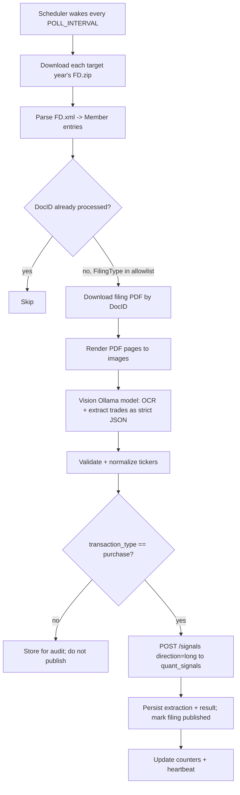

# Spec: House Financial Disclosure Ingestion (Sliced) — v1

> **Status:** Draft / revision 3 (review feedback folded in) — House decisions locked; feedback welcome
> **Scope:** U.S. **House of Representatives** financial disclosures only. The Senate is a
> parallel, separately-tracked process and is explicitly **out of scope** for this issue
> (a follow-up issue will mirror this structure for the Senate).
> **Sibling services:** produces signals for [`quant_signals`](https://github.com/mayberryjp/quant_signals)
> (watchlist service). Follows the code standards established in `quant_signals` and `quant_sentiment`.

## 1. Goal

Stand up a persistent service that periodically ingests newly-filed U.S. House financial
disclosures, uses a local **vision-capable Ollama LLM** to **OCR and extract** the securities
(ticker symbols) named in each disclosure into a structured dataset, and **publishes each
purchased ticker as a signal** to the `quant_signals` watchlist via `POST /signals`.

The service runs under **supervisord** as a long-lived worker that "wakes up" on a schedule,
determines what has been filed **since the last run**, processes only the new filings, and
records durable state so work is never repeated.

## 2. Non-goals (v1)

- No Senate ingestion (separate issue).
- No trade execution, brokerage integration, or portfolio construction.
- No frontend UI.
- No re-implementation of watchlist storage — that lives in `quant_signals`.
- No separate/deterministic PDF text parser — **OCR and extraction are both delegated to the LLM** (§4.2).
- No publishing of sales or exchanges — **only purchases** produce signals (others stored for audit only).

## 3. Background & data source (House)

Disclosure of Member securities transactions is mandated by the **STOCK Act (2012)** and
published online by the **Clerk of the House** at `disclosures-clerk.house.gov`.

### 3.1 Annual index (the manifest we diff against)

- **Per-year ZIP:** `https://disclosures-clerk.house.gov/public_disc/financial-pdfs/{YEAR}FD.zip`
- The ZIP contains `{YEAR}FD.xml` (the index) and `{YEAR}FD.txt` (tab-delimited equivalent).
- The ZIP is the **full year to date** and is re-published as new filings arrive, so each cycle
  we re-download it and diff against filings we have already processed.

**XML shape** (one `<Member>` element per filing):

```xml
<FinancialDisclosure>
  <Member>
    <Prefix/>
    <Last>Aaron</Last>
    <First>Richard</First>
    <Suffix/>
    <FilingType>W</FilingType>
    <StateDst>MI04</StateDst>
    <Year>2026</Year>
    <FilingDate>4/15/2026</FilingDate>
    <DocID>8068</DocID>
  </Member>
  ...
</FinancialDisclosure>
```

| Field        | Meaning                                                        |
|--------------|----------------------------------------------------------------|
| `Prefix/Last/First/Suffix` | Filer name                                       |
| `FilingType` | Single-letter document type code (see 3.3)                     |
| `StateDst`   | State + district, e.g. `MI04`                                  |
| `Year`       | Filing year (matches ZIP year)                                 |
| `FilingDate` | `M/D/YYYY` (US format, no zero-padding)                        |
| `DocID`      | Stable document identifier; used to build the document URL     |

### 3.2 Individual filing documents

Individual filings are **PDFs, not XML** — the XML is only the manifest. Given a `DocID`,
`Year`, and type, the document URL is (patterns to be locked/verified in Slice 2):

- **Periodic Transaction Report (PTR):** `https://disclosures-clerk.house.gov/public_disc/ptr-pdfs/{YEAR}/{DocID}.pdf`
- **Annual/other FD statement:** `https://disclosures-clerk.house.gov/public_disc/financial-pdfs/{YEAR}/{DocID}.pdf`

**Paper vs electronic — handled uniformly.** Short numeric `DocID`s (e.g. `8068`) are typically
**scanned paper** filings (image-only PDFs), while long 8-digit `DocID`s (e.g. `10078673`) are
**electronic** filings with a text layer. Because **OCR is delegated to a vision-capable LLM**
(§4.2), both are processed identically: each PDF page is rendered to an image and sent to the
model — there is no separate text-extraction/OCR branch and no `needs_ocr` deferral.

### 3.3 Filing types

`FilingType` is a single letter. The **trade-bearing** report is the **Periodic Transaction
Report (PTR)** — it itemizes individual purchases/sales of securities (the STOCK Act 30–45 day
report). Annual FD statements also contain a transactions schedule but are broader and noisier.

> ⚠️ The exact letter→meaning mapping (e.g. `P` = PTR, `C` = Candidate, plus amendment/extension/
> new-filer/termination codes) **must be verified** against the House "Instruction Guide for
> Financial Disclosure Statements and Periodic Transaction Reports" and validated empirically from
> a sample year. Therefore the set of processed types is a **configurable allowlist**
> (`TARGET_FILING_TYPES`), defaulting to PTR only in v1.

## 4. Architecture

The service adopts the `quant_signals` stack and conventions:

- **Language/runtime:** Python ≥ 3.11.
- **API:** `bottle` served by `waitress`; entrypoint `python3 -m app.main`.
- **Durable store:** PostgreSQL via SQLAlchemy 2.0 + Alembic (filing/extraction audit + permanent dedup).
- **Runtime cache / coordination:** Redis (`redis[hiredis]`) — run-state, counters, heartbeat, locks. Key prefix **`qp:`** (quant-politicians), mirroring `qs:` in `quant_signals`.
- **Config:** `pydantic` + `pydantic-settings` from `.env`.
- **Process orchestration:** `supervisord` (alembic-migrate one-shot → API → scheduled worker).
- **Tests:** `pytest`, `webtest`, `fakeredis`; HTTP + Ollama mocked.
- **Packaging/ops:** `pyproject.toml`, `requirements.txt`, `Dockerfile`, `docker-compose*.yml`, `docs/`, `.github/workflows/`.

### 4.1 Components

| Component | Responsibility |
|---|---|
| **Index poller** | Download `{YEAR}FD.zip`, extract + parse `{YEAR}FD.xml`, upsert filing rows, compute "new since last run". |
| **Filing fetcher** | For each new targeted filing, resolve + download the PDF, dedupe by content hash. |
| **PDF renderer** | Render each PDF page to an image (`pypdfium2`, no system deps) for the vision model. |
| **LLM OCR + extractor** | Send rendered page image(s) to a **vision-capable** Ollama model; the model performs **OCR and structured extraction in one step**, returning **strict JSON** validated against a `pydantic` schema (retry on malformed output). |
| **Signal publisher** | Map each **purchase** → `POST /signals` on `quant_signals`; handle `accepted`/`duplicate`/`unresolved`. |
| **Scheduler/worker** | Long-lived loop that wakes every `POLL_INTERVAL`, runs the pipeline, writes heartbeat, applies backoff. |
| **Read API** | `bottle` app: `/politicians-cache/health`, `/ready`, `/stats`, plus read endpoints for filings/extractions. |

### 4.2 Data flow



### 4.3 Signal mapping (producer contract)

We are a **signal producer** for `quant_signals`. **Only purchases are published** — sales and
exchanges are extracted and stored for audit but never posted. Each published purchase becomes one signal:

| `quant_signals` field | Value |
|---|---|
| `source` | `house-disclosures-v1` (configurable via `SIGNALS_SOURCE_NAME`) |
| `idempotency_key` | `house-disclosures-v1:{DocID}:{TICKER}` (deterministic per filing+ticker) |
| `ticker` | Extracted symbol, uppercased |
| `reason` | e.g. `Rep. {First} {Last} ({StateDst}) disclosed a purchase of {TICKER} ({amount_range}) on {transaction_date}. House PTR DocID {DocID}, filed {FilingDate}.` |
| `market` / `locale` | `stocks` / `us` |
| `signal_type` | `watchlist_candidate` (default) |
| `direction` | `long` (purchases only) |
| `tags` | `["congress","house","ptr","purchase","{state}"]` |
| `metadata` | `{ doc_id, filing_type, filing_date, member{first,last,state_dst}, transaction{type,date,amount_range,asset_name,owner}, source_url, llm_model, extraction_confidence, schema_version }` |

> `quant_signals` performs its own symbol resolution and returns `unresolved` for unknown tickers,
> so local ticker validation is limited to sanity/normalization (uppercase, length ≤ 20, charset)
> — we rely **solely** on the watchlist service as the authority; **no local symbol master** is maintained.

## 5. Configuration (`.env`)

| Var | Default | Purpose |
|---|---|---|
| `HOUSE_FD_BASE_URL` | `https://disclosures-clerk.house.gov` | Data source root |
| `HOUSE_FD_YEARS` | `current` | Years to process: `current`, explicit list (e.g. `2024,2025,2026`), or `all` |
| `BACKFILL_YEARS` | *(unset)* | Prior years to process on first run (backfill), then tracked in state |
| `TARGET_FILING_TYPES` | `P` | Allowlist of filing-type codes to process (default PTR; verified in Slice 1) |
| `PUBLISH_TRANSACTION_TYPES` | `purchase` | Transaction types that produce signals (purchases only by default) |
| `HISTORICAL_START_DATE` | *(unset)* | Optionally ignore filings before this date |
| `POLL_INTERVAL` | `3600` | Seconds between worker cycles |
| `OLLAMA_URL` | `http://localhost:11434` | Ollama endpoint (**env-driven**) |
| `OLLAMA_MODEL` | *(required, no default)* | **Vision-capable** model for OCR + extraction (**env-driven**) |
| `OLLAMA_TIMEOUT` | `180` | Per-request timeout (s) |
| `SIGNALS_API_URL` | *(required)* | `quant_signals` base URL (**env-driven**) |
| `SIGNALS_SOURCE_NAME` | `house-disclosures-v1` | Producer `source` |
| `HTTP_USER_AGENT` | `quant_politicians/0.1 (+contact)` | Polite UA for scraping |
| `MAX_DOC_BYTES` | `52428800` | Download/zip-bomb guard |
| `MAX_DOC_PAGES` | `20` | Page cap per document (protects the vision model) |
| `DATABASE_URL` | — | Postgres DSN |
| `QUANT_REDIS_URL` | `redis://localhost:6379/0` | Redis |
| `API_PORT` | `8017` | Read API port |

## 6. Durable state (Postgres)

- **`house_filings`** — `doc_id` (PK), name parts, `filing_type`, `state_dst`, `year`,
  `filing_date`, `first_seen_at`, `status` (`new`/`fetched`/`rendered`/`extracted`/`published`/`failed`/`skipped`),
  `doc_url`, `doc_sha256`, `page_count`, `fetch_attempts`, `last_error`, `updated_at`.
- **`house_extractions`** — `id` (PK), `doc_id` (FK), `ticker`, `asset_name`,
  `transaction_type`, `transaction_date`, `amount_range`, `owner`, `raw_json`, `llm_model`,
  `confidence`, `idempotency_key`, `published` (bool), `signal_result`, `created_at`.

Redis holds ephemeral run-state: `qp:poll:heartbeat`, `qp:poll:last_run`, `qp:counter:*`,
`qp:lock:poll` (single-flight lock), each JSON value carrying a `schema_version`.

## 7. Slices

Each slice is an independently shippable, testable vertical increment.

### Slice 0 — Project scaffold & standards parity
- **Deliverables:** repo skeleton matching `quant_signals` (`app/`, `app/services/`, `alembic/`,
  `tests/`, `docs/`, `.github/workflows/`); `pyproject.toml`/`requirements.txt` (bottle, waitress,
  redis, SQLAlchemy, alembic, psycopg, pydantic, pydantic-settings, pytest, webtest, fakeredis,
  plus `httpx`/`requests`, `pypdfium2` for PDF→image rendering); `Dockerfile`, `docker-compose*.yml`, `supervisord.conf`
  (alembic-migrate → api → worker), `.env.example`, `pydantic-settings` config module; minimal
  `bottle` API with `/politicians-cache/health`, `/ready`, `/stats`; CI workflow running `pytest`.
- **Acceptance:** `docker compose up` boots all supervisord programs; health returns `ok`;
  readiness reflects Redis + worker heartbeat; `pytest` green in CI.

### Slice 1 — House index ingestion, backfill & "since last run"
- **Deliverables:** index poller downloads each target year's `{YEAR}FD.zip` (streamed, size-capped)
  per `HOUSE_FD_YEARS`/`BACKFILL_YEARS`, extracts and parses `{YEAR}FD.xml`, upserts `house_filings`,
  computes new filings by `DocID` diff + `FilingDate` watermark; empirically confirms the PTR
  `FilingType` code from real data; Alembic migration for `house_filings`.
- **Acceptance:** given fixture ZIP/XML, all `<Member>` rows are upserted idempotently; a second run
  yields zero new filings; **backfill of a prior year processes that year once then no-ops**; malformed
  rows are skipped and counted; date parsing handles `M/D/YYYY`.

### Slice 2 — Filing document retrieval
- **Deliverables:** filing fetcher builds the PDF URL from `DocID`/`Year`/type, downloads with
  polite UA + retry/backoff + size cap, stores bytes + `doc_sha256`, records `page_count`, sets
  status `fetched`.
- **Acceptance:** URL patterns verified against live samples (both short paper and long electronic
  `DocID`s); duplicate content deduped by hash; network errors retried then marked `failed` with
  `last_error`; per-filing failures don't abort the batch.

### Slice 3 — Vision-LLM OCR + extraction via Ollama
- **Deliverables:** PDF renderer (`pypdfium2`) rasterizes each page (page-capped by `MAX_DOC_PAGES`);
  client sends the page image(s) to the **vision-capable** `OLLAMA_MODEL` with a JSON-output prompt so
  the model performs **OCR and extraction in one step**; `pydantic` schema `ExtractedTrade[]`
  (`asset_name`, `ticker|null`, `transaction_type`, `transaction_date`, `amount_range`, `owner`,
  `confidence`); malformed-JSON retry; entries with null/invalid ticker flagged for review; results
  persisted to `house_extractions`.
- **Acceptance:** with a mocked Ollama returning known JSON, extractions persist correctly for **both**
  a scanned and an electronic sample PTR (OCR path exercised); malformed responses trigger bounded
  retries then a counted failure; tickers normalized (uppercase, charset, length ≤ 20);
  **no hallucinated ticker is posted without passing validation.**

### Slice 4 — Signal publishing to `quant_signals` (purchases only)
- **Deliverables:** signal publisher filters extractions to `PUBLISH_TRANSACTION_TYPES` (default
  `purchase`), maps each to the producer contract (§4.3) with `direction=long`, and `POST`s to
  `SIGNALS_API_URL/signals`; handles `accepted`/`duplicate`/`unresolved`; records `signal_result` +
  `idempotency_key`; marks filing `published`.
- **Acceptance:** against a mocked `quant_signals`, each purchase posts once and **sales/exchanges are
  not posted**; re-running does not re-post (permanent dedup + idempotency key); `unresolved`/`duplicate`
  handled without error and surfaced in counters.

### Slice 5 — Scheduling, supervisord worker & observability
- **Deliverables:** long-lived worker loop (`python3 -m app.services.house_worker --schedule N`)
  wired into `supervisord.conf`; single-flight Redis lock; heartbeat + `last_run`; structured logs;
  counters (`filings_seen`, `new_filings`, `docs_fetched`, `pages_rendered`, `extraction_ok/failed`,
  `purchases_extracted`, `signals_posted/duplicate/unresolved`, `failed`); `/stats` surfaces them.
- **Acceptance:** worker wakes on schedule, processes only new filings, updates heartbeat; readiness
  degrades if heartbeat is stale; a crashing cycle is retried by supervisord without duplicate posting.

### Slice 6 — Read API & runbook (parity)
- **Deliverables:** read endpoints (`/filings`, `/filings/{doc_id}`, `/extractions`, filters +
  pagination); `docs/runbook.md`, `docs/data_source.md`, `docs/producer_mapping.md`.
- **Acceptance:** endpoints return persisted data with filters; runbook curl examples work end-to-end.

## 8. Cross-cutting concerns

- **Idempotency (layered):** permanent Postgres dedup by `DocID`/`idempotency_key` **and** the
  `quant_signals` 24h idempotency key — re-runs never double-post.
- **Politeness / rate limiting:** custom UA, inter-request delay, exponential backoff, on-disk cache
  of downloaded artifacts; respect the source's terms.
- **Resilience:** per-filing isolation; failures recorded with `fetch_attempts`/`last_error` and
  retried with a cap; one bad PDF never aborts a cycle.
- **Security:** stream + size-cap all downloads (zip-bomb/large-PDF guard); treat PDF and LLM output
  as untrusted (validate/sanitize, never eval); no secrets in logs; outbound calls only to the
  configured House, Ollama, and `quant_signals` hosts.
- **LLM / OCR safety:** vision model runs at low temperature with JSON-only output and schema
  validation, bounded retries on malformed output; hallucinated or unverifiable tickers are
  quarantined, not published; documents are page-capped (`MAX_DOC_PAGES`) to bound OCR cost.
- **Testing:** fixtures for ZIP/XML and sample PDFs; mocked Ollama + mocked `quant_signals`;
  `fakeredis`; deterministic date handling.
- **Observability:** structured logs, Redis counters, heartbeat, `/stats`.

## 9. Resolved decisions

**Resolved (review 2026-07-04):**
- **OCR + extraction:** delegated to a **single vision-capable Ollama LLM** step — no separate PDF
  text parser or OCR branch; scanned and electronic filings are handled identically.
- **Purchases only:** only `purchase` transactions are published (`direction=long`); sales and
  exchanges are stored for audit but never posted.
- **`quant_signals` URL:** provided via env (`SIGNALS_API_URL`); `source = house-disclosures-v1`.
- **Ollama:** endpoint (`OLLAMA_URL`) via env; model (`OLLAMA_MODEL`) is **required with no default**.
- **Ticker authority:** rely **solely on `quant_signals` symbol resolution** — **no local symbol
  master** is maintained; unknown tickers surface as `unresolved`.
- **Backfill:** supported via `HOUSE_FD_YEARS` / `BACKFILL_YEARS` (prior-year ZIPs).
- **Filing-type scope:** **PTR-only** by default (`TARGET_FILING_TYPES=P`), confirmed empirically in
  Slice 1; the allowlist stays configurable.

No open blockers remain for the House spec.

## 10. Sibling: Senate (issue #2)

The Senate (`efdsearch.senate.gov`) publishes eFD data through a different (search/POST-based) flow
and is specced separately in **issue #2** as a parallel worker (`senate-disclosures-v1`) that shares
the same extraction + publishing components and the same `quant_signals` producer contract.
