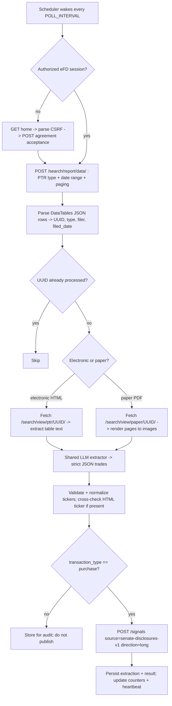

# Spec: Senate Financial Disclosure Ingestion (Sliced) — v1

> **Status:** Draft / revision 2 (review feedback folded in) — Senate decisions locked; feedback welcome
> **Scope:** U.S. **Senate** financial disclosures only. This is the sibling of the House spec
> (issue #1) and **reuses the same core** (LLM OCR + extraction, ticker validation, `quant_signals`
> publishing, scheduler, state, observability). Only the **acquisition layer** differs, because the
> Senate publishes through a **search application**, not a bulk XML index.
> **Sibling services:** produces signals for [`quant_signals`](https://github.com/mayberryjp/quant_signals).
> Follows the code standards established in `quant_signals`.

## 1. Goal

Stand up a persistent worker that periodically ingests newly-filed U.S. **Senate** financial
disclosures, uses a local **vision-capable Ollama LLM** to **OCR and extract** the securities
(ticker symbols) named in each disclosure into a structured dataset, and **publishes each
purchased ticker as a signal** to the `quant_signals` watchlist via `POST /signals`.

Runs under **supervisord** alongside the House worker, waking on a schedule, determining what has
been filed **since the last run**, processing only new reports, and recording durable state so work
is never repeated. The **House decisions carry over**: LLM does OCR + extraction; **purchases only**
(`direction=long`); endpoints/model are env-driven; `OLLAMA_MODEL` is **required (no default)**;
**no local symbol master** (rely on `quant_signals` resolution); **backfill supported**.

## 2. Non-goals (v1)

- No House ingestion (that is issue #1).
- No trade execution, brokerage integration, or portfolio construction.
- No frontend UI.
- No re-implementation of watchlist storage — that lives in `quant_signals`.
- No separate/deterministic parser as the primary path — **OCR and extraction are delegated to the LLM**
  (an available HTML ticker column is used only as a cross-check, §5.3).
- No publishing of sales or exchanges — **only purchases** produce signals (others stored for audit).

## 3. Background & data source (Senate eFD)

The Senate publishes disclosures through the **Electronic Financial Disclosure (eFD)** system,
mandated by the Ethics in Government Act and the STOCK Act (which required the Senate to establish
electronic filing). The official public entry point is `https://www.disclosure.senate.gov/`, which
directs users to the eFD search application at `https://efdsearch.senate.gov`. Reports cover
**2012 to present**.

**There is no official XML feed or public API.** Unlike the House (annual ZIP/XML index), Senate data
is obtained by driving the eFD search UI's **internal JSON endpoint** and then fetching each report's
HTML (electronic) or PDF (paper) page — the same practical approach existing open-source scrapers use.

| Need | Source |
|---|---|
| Official public UI (human entry point) | `https://www.disclosure.senate.gov/` → eFD |
| Search backend (internal JSON endpoint) | `POST https://efdsearch.senate.gov/search/report/data/` |
| Individual electronic PTR pages | `https://efdsearch.senate.gov/search/view/ptr/<uuid>/` |
| Individual paper (scanned) reports | `https://efdsearch.senate.gov/search/view/paper/<uuid>/` |
| Official XML / API listing | **None** — must scrape the search endpoint |

### 3.1 The eFD access flow (session + agreement + CSRF)

Access requires an authorized session:

1. **`GET /search/home/`** → returns HTML containing a CSRF token (`csrfmiddlewaretoken`) and sets a
   `csrftoken` cookie.
2. **`POST /search/home/`** with `prohibition_agreement=1` + the CSRF token → accepts the mandatory
   usage agreement (Ethics in Government Act, §3.5) and establishes an authorized **session cookie**.
3. **`GET /search/`** → the search page (carries the CSRF token used by the data endpoint).
4. **`POST /search/report/data/`** (the actual query) with a **DataTables**-style payload:
   `csrfmiddlewaretoken`, `draw`, `start`, `length`, `report_types[]`, `filer_types[]`,
   `submitted_start_date`, `submitted_end_date` (MM/DD/YYYY), optional name/state filters.
   → returns JSON: `{ "data": [[first, last, "<a href='/search/view/ptr/<uuid>/'>…</a>", type_label, filed_date], …], "recordsTotal": N, "recordsFiltered": N }`.

Pagination: iterate `start` by `length` until `recordsTotal` is covered. Sessions expire → re-auth.

### 3.2 Report identifiers & types

- The **identifier** is a **UUID** embedded in the report link (`…/view/<kind>/<uuid>/`) — the Senate
  analogue of the House `DocID`.
- **Report types** are numeric codes selected in the search form. The **trade-bearing** type is the
  **Periodic Transaction Report (PTR)** (individual securities transactions). Annual reports are
  broader/noisier.

> ⚠️ The numeric `report_types` code for a PTR **must be verified** empirically against the live
> search form and a sample query. It is therefore a **configurable allowlist** (`SENATE_REPORT_TYPES`),
> defaulting to the PTR code in v1.

### 3.3 Report formats (electronic vs paper)

Each report link resolves to one of two forms:

| Kind | URL pattern | Format | Handling |
|---|---|---|---|
| **Electronic** | `/search/view/ptr/<uuid>/` | HTML page with a transactions table (may include a **Ticker** column) | Extract table text → LLM |
| **Paper** | `/search/view/paper/<uuid>/` | Scanned **PDF** (image-only) | Render pages → **vision** LLM (OCR) |

Both converge on the **same shared LLM extractor** and validation/publish path. Because electronic
reports often expose a ticker column, that column is used as a **deterministic cross-check** against
the LLM output (§5.3) — a quality advantage the House data does not offer.

### 3.4 "Since last run"

- Query with `submitted_start_date` = the persisted **watermark** (last successful run's max filed
  date, minus a small safety overlap) and `submitted_end_date` = today.
- Deduplicate by **report UUID** against durable state, so overlap never double-processes.
- **Backfill:** set the start date back to `SENATE_BACKFILL_START_DATE` (e.g. `01/01/2012`); processed
  UUIDs are tracked so backfill runs once then no-ops.

### 3.5 Legal & compliance (must read)

The eFD agreement (Ethics in Government Act, 5 U.S.C. app. §105(c)) states reports may **not** be
obtained or used: for any unlawful purpose; **for any commercial purpose** (other than by news/
communications media for dissemination to the general public); for determining credit ratings; or in
the **solicitation of money**. Civil penalties apply.

Implications for this service:
- The worker programmatically accepts the agreement each session; **the operator is responsible for
  ensuring their actual use complies** with these terms (e.g. personal research/analysis).
- Be a good citizen: honor `robots.txt`/ToS, send an identifying `User-Agent`, and apply conservative
  rate limiting (§9) — the eFD site is known to throttle aggressive clients.
- This item is called out so the decision to deploy is made deliberately.

## 4. Architecture

Same stack and conventions as `quant_signals` / the House worker (Python ≥ 3.11, `bottle`+`waitress`,
Redis prefix `qp:`, Postgres + SQLAlchemy 2.0 + Alembic, `pydantic-settings`, supervisord, pytest/
webtest/fakeredis). The Senate worker is an **additional supervisord program** that **reuses** the
shared core and adds a Senate-specific acquisition layer.

### 4.1 Components

| Component | New / Shared | Responsibility |
|---|---|---|
| **eFD session manager** | New (Senate) | Handshake (home → CSRF → agreement POST), hold cookies, re-auth on expiry. |
| **Search ingester** | New (Senate) | POST the DataTables query (PTR + date range), paginate, parse rows → UUID/type/filer/date; upsert `senate_filings`; compute "new since last run" + backfill. |
| **Report fetcher** | New (Senate) | Resolve report URL by kind; fetch electronic HTML or download paper PDF; classify; hash; record page count. |
| **Content capture** | New (Senate) | Electronic → extract table text (`beautifulsoup4`); paper → render pages to images (`pypdfium2`). |
| **LLM OCR + extractor** | **Shared** | Send captured text/images to the vision-capable Ollama model → strict JSON, `pydantic`-validated. |
| **Ticker validator** | **Shared** | Normalize (uppercase, charset, length ≤ 20); rely on `quant_signals` resolution; no local master. |
| **Signal publisher** | **Shared** | Filter to purchases → `POST /signals` (`source=senate-disclosures-v1`, `direction=long`). |
| **Scheduler/worker** | **Shared pattern** | `senate_worker` loop: wake, run pipeline, heartbeat, backoff, single-flight lock. |
| **Read API / stats** | **Shared** | Extend `/politicians-cache/stats`, `/ready`; add Senate read endpoints. |

### 4.2 Data flow

### 4.3 Signal mapping (producer contract)

Identical contract to the House, differing only in `source`, identifier, and tags. **Only purchases
are published.**

| `quant_signals` field | Value |
|---|---|
| `source` | `senate-disclosures-v1` (configurable via `SIGNALS_SOURCE_NAME`) |
| `idempotency_key` | `senate-disclosures-v1:{report_uuid}:{TICKER}` |
| `ticker` | Extracted symbol, uppercased |
| `reason` | e.g. `Sen. {First} {Last} disclosed a purchase of {TICKER} ({amount_range}) on {transaction_date}. Senate PTR {report_uuid}, filed {filed_date}.` |
| `market` / `locale` | `stocks` / `us` |
| `signal_type` | `watchlist_candidate` (default) |
| `direction` | `long` (purchases only) |
| `tags` | `["congress","senate","ptr","purchase","{state}"]` |
| `metadata` | `{ report_uuid, report_type, filed_date, is_paper, member{first,last,state}, transaction{type,date,amount_range,asset_name,owner}, source_url, llm_model, extraction_confidence, html_ticker_crosscheck, schema_version }` |

> **Ticker cross-check (electronic only):** when the HTML table exposes a ticker, compare it to the
> LLM's ticker. On mismatch, prefer the HTML value and flag the extraction for review — this bounds
> LLM hallucination for the electronic majority. Unknown tickers still surface via `quant_signals`
> `unresolved`.

## 5. Configuration (`.env`)

Shared with the House worker unless marked **(Senate)**.

| Var | Default | Purpose |
|---|---|---|
| `SENATE_EFD_BASE_URL` **(Senate)** | `https://efdsearch.senate.gov` | Data source root |
| `SENATE_REPORT_TYPES` **(Senate)** | *(PTR code)* | Allowlist of report-type codes (verified in Slice 2) |
| `SENATE_FILER_TYPES` **(Senate)** | `all` | Filer types to include — default **all** (senators, candidates, former senators) |
| `SENATE_BACKFILL_START_DATE` **(Senate)** | *(unset)* | Backfill start (e.g. `01/01/2012`), processed once |
| `SENATE_SEARCH_PAGE_SIZE` **(Senate)** | `100` | DataTables `length` per request |
| `SENATE_REQUEST_DELAY` **(Senate)** | `2.0` | Seconds between eFD requests (politeness/throttle) |
| `SIGNALS_SOURCE_NAME` | `senate-disclosures-v1` | Producer `source` for this worker |
| `PUBLISH_TRANSACTION_TYPES` | `purchase` | Transaction types that produce signals |
| `POLL_INTERVAL` | `3600` | Seconds between worker cycles |
| `OLLAMA_URL` | `http://localhost:11434` | Ollama endpoint (**env-driven**) |
| `OLLAMA_MODEL` | *(required, no default)* | **Vision-capable** model for OCR + extraction |
| `OLLAMA_TIMEOUT` | `180` | Per-request timeout (s) |
| `SIGNALS_API_URL` | *(required)* | `quant_signals` base URL (**env-driven**) |
| `HTTP_USER_AGENT` | `quant_politicians/0.1 (+contact)` | Identifying UA |
| `MAX_DOC_BYTES` | `52428800` | Download guard |
| `MAX_DOC_PAGES` | `20` | Page cap per paper document |
| `DATABASE_URL` | — | Postgres DSN |
| `QUANT_REDIS_URL` | `redis://localhost:6379/0` | Redis |

## 6. Durable state (Postgres)

- **`senate_filings`** — `report_uuid` (PK), `first`, `last`, `state`, `filer_type`, `report_type`,
  `filed_date`, `report_url`, `is_paper` (bool), `first_seen_at`,
  `status` (`new`/`fetched`/`captured`/`extracted`/`published`/`failed`/`skipped`),
  `content_sha256`, `page_count`, `fetch_attempts`, `last_error`, `updated_at`.
- **`senate_extractions`** — `id` (PK), `report_uuid` (FK), `ticker`, `asset_name`,
  `transaction_type`, `transaction_date`, `amount_range`, `owner`, `raw_json`, `llm_model`,
  `confidence`, `html_ticker` (cross-check), `idempotency_key`, `published` (bool), `signal_result`,
  `created_at`.

Redis run-state (Senate-scoped): `qp:senate:session` (cookies/CSRF, short TTL),
`qp:senate:poll:heartbeat`, `qp:senate:poll:watermark`, `qp:senate:counter:*`, `qp:senate:lock:poll`,
each JSON value carrying a `schema_version`.

## 7. Slices

Each slice is an independently shippable, testable vertical increment. Slices reusing the House
shared core are marked **[reuse]**.

### Slice 0 — Senate module scaffold & shared-core wiring **[reuse]**
- **Deliverables:** `app/services/senate_worker.py` skeleton; Senate config in `pydantic-settings`;
  a second `supervisord` program (`senate-worker`); Alembic migration stubs for `senate_filings` /
  `senate_extractions`; `/politicians-cache/stats` and `/ready` extended with Senate keys.
- **Acceptance:** `docker compose up` boots the Senate worker alongside House; health/readiness/stats
  include Senate; `pytest` green in CI.

### Slice 1 — eFD session & agreement handshake **(Senate)**
- **Deliverables:** session manager that GETs `/search/home/`, parses `csrfmiddlewaretoken`, POSTs
  `prohibition_agreement=1`, persists cookies to `qp:senate:session`; detects expiry and re-auths;
  identifying `User-Agent` + `SENATE_REQUEST_DELAY`.
- **Acceptance:** against a mocked eFD, the client obtains an authorized session, reuses it across
  requests, and transparently re-auths after expiry; CSRF parsing is covered by tests.

### Slice 2 — Search ingestion, backfill & "since last run" **(Senate)**
- **Deliverables:** POST `/search/report/data/` with `SENATE_REPORT_TYPES` + date window +
  DataTables paging; parse rows → `report_uuid`, `report_type`, `filer`, `state`, `filed_date`,
  `is_paper`; upsert `senate_filings`; compute new-by-UUID + watermark; backfill from
  `SENATE_BACKFILL_START_DATE`; empirically confirm the PTR type code; Alembic migration.
- **Acceptance:** fixture JSON paginates fully; a second run yields zero new; **backfill processes a
  historical window once then no-ops**; malformed rows skipped/counted; date parsing handles
  `MM/DD/YYYY`.

### Slice 3 — Report retrieval (electronic HTML + paper PDF) **(Senate)**
- **Deliverables:** resolve report URL by kind (`view/ptr` vs `view/paper`); fetch with the
  authorized session + retry/backoff + size cap; classify electronic vs paper; store content +
  `content_sha256`; record `page_count` for paper; set status `fetched`.
- **Acceptance:** URL patterns verified against live samples (electronic + paper); duplicates deduped
  by hash; per-report failures retried then marked `failed` without aborting the batch.

### Slice 4 — Content capture → LLM extraction **[reuse extractor]**
- **Deliverables:** electronic → extract transactions-table text (`beautifulsoup4`); paper → render
  pages to images (`pypdfium2`, page-capped); feed both into the **shared** LLM extractor →
  `ExtractedTrade[]` (`asset_name`, `ticker|null`, `transaction_type`, `transaction_date`,
  `amount_range`, `owner`, `confidence`); persist to `senate_extractions`; **HTML ticker cross-check**
  for electronic reports (prefer HTML on mismatch, flag for review).
- **Acceptance:** with a mocked Ollama, both electronic and paper samples extract correctly (OCR path
  exercised for paper); malformed responses trigger bounded retries then a counted failure; tickers
  normalized; HTML/LLM mismatches are flagged; **no hallucinated ticker is posted without validation.**

### Slice 5 — Signal publishing to `quant_signals` (purchases only) **[reuse publisher]**
- **Deliverables:** filter extractions to `PUBLISH_TRANSACTION_TYPES` (default `purchase`), map to the
  producer contract (§4.3) with `source=senate-disclosures-v1`, `direction=long`, idempotency
  `senate-disclosures-v1:{uuid}:{TICKER}`; POST to `SIGNALS_API_URL/signals`; record `signal_result`;
  mark filing `published`.
- **Acceptance:** each purchase posts once; **sales/exchanges are not posted**; re-running does not
  re-post (permanent dedup + idempotency); `unresolved`/`duplicate` handled and surfaced in counters.

### Slice 6 — Scheduling, supervisord worker & observability **[reuse pattern]**
- **Deliverables:** `python3 -m app.services.senate_worker --schedule N` wired into `supervisord.conf`;
  single-flight Redis lock (`qp:senate:lock:poll`); heartbeat + watermark; structured logs; counters
  (`reports_seen`, `new_reports`, `reports_fetched`, `pages_rendered`, `extraction_ok/failed`,
  `purchases_extracted`, `ticker_mismatches`, `signals_posted/duplicate/unresolved`, `failed`);
  `/stats` surfaces them.
- **Acceptance:** worker wakes on schedule, processes only new reports, updates heartbeat; readiness
  degrades if heartbeat is stale; a crashing cycle is retried by supervisord without duplicate posting.

### Slice 7 — Read API & runbook (parity)
- **Deliverables:** Senate read endpoints (`/senate/filings`, `/senate/filings/{uuid}`,
  `/senate/extractions`, filters + pagination); `docs/data_source_senate.md`, runbook additions
  (session/agreement troubleshooting, throttling guidance).
- **Acceptance:** endpoints return persisted data with filters; runbook curl examples work end-to-end.

## 8. Cross-cutting concerns

- **Session & CSRF resilience:** treat 403/redirect-to-agreement as "session expired" → re-auth and
  retry once; never hammer the endpoint on auth failure.
- **Rate limiting / politeness (critical):** enforce `SENATE_REQUEST_DELAY`, exponential backoff on
  429/5xx, identifying `User-Agent`, and on-disk caching of fetched reports; the eFD site throttles.
- **Idempotency (layered):** permanent Postgres dedup by `report_uuid`/`idempotency_key` **and** the
  `quant_signals` 24h idempotency key.
- **Resilience:** per-report isolation; failures recorded with `fetch_attempts`/`last_error`, retried
  with a cap; one bad report never aborts a cycle.
- **Security:** size-cap downloads; treat HTML, PDF, and LLM output as untrusted (parse/validate,
  never eval); outbound calls only to the configured eFD, Ollama, and `quant_signals` hosts; no
  secrets/cookies in logs.
- **LLM / OCR safety:** vision model at low temperature, JSON-only output, schema validation, bounded
  retries; HTML ticker cross-check; page-capped documents.
- **Compliance:** see §3.5 — deliberate operator opt-in; identifying UA; conservative rates.
- **Testing:** fixtures for the agreement HTML, DataTables JSON, an electronic PTR HTML page, and a
  scanned paper PDF; mocked Ollama + mocked `quant_signals`; `fakeredis`.
- **Observability:** structured logs, Redis counters, heartbeat, `/stats`.

## 9. Resolved decisions

**Carried over from House review:**
- OCR + extraction via a **single vision-capable Ollama LLM**; **purchases only** (`direction=long`);
  endpoints/model **env-driven**; `OLLAMA_MODEL` **required (no default)**; **no local symbol master**;
  **backfill supported**.

**Senate-specific (review 2026-07-04):**
- **PTR-only:** `SENATE_REPORT_TYPES` defaults to the PTR code (confirmed empirically in Slice 2); the
  allowlist stays configurable.
- **Filer scope — all people:** `SENATE_FILER_TYPES` defaults to **all filer types** (senators,
  candidates, and former senators); no filer filtering applied.
- **HTML ticker cross-check:** on HTML/LLM mismatch, **prefer the HTML ticker** and flag the extraction
  for review (electronic reports only).
- **Compliance (§3.5):** the operator accepts responsibility for ensuring use complies with the eFD
  agreement (non-commercial / not for solicitation).

No open blockers remain for the Senate spec.

## 10. Relationship to the House worker (issue #1)

The Senate and House workers share one codebase and the same `quant_signals` producer contract; they
differ only in acquisition (search/session/CSRF + HTML/PDF for the Senate vs ZIP/XML + PDF for the
House) and identifiers (UUID vs DocID). The **LLM extractor, ticker validator, signal publisher,
scheduler pattern, Redis/Postgres conventions, and read API** are common. Recommended sequencing:
land the House shared core (issue #1, Slice 0–5) first, then the Senate acquisition slices here plug
into it.
